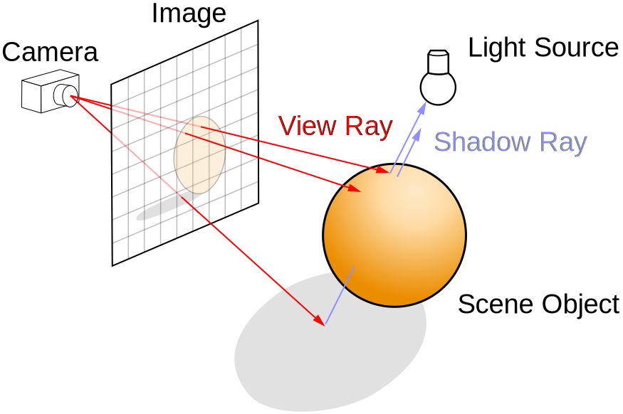

# miniRT
miniRT is a project coded in C language that utilizes ray tracing algorithms, built using the MLX42 library. The program renders simple computer-generated images using fundamental ray tracing techniques. What I particularly enjoyed during development was implementing mathematical formulas for calculating intersections of rays with various 3D geometric shapes, such as planes, spheres and cylinders.

## 👀 YouTube Video: Code-Princess/Mein selbst programmierter Ray Tracer miniRT in C mit MLX42/3D-Rendering
<!-- YouTube video cards from https://github.com/DenverCoder1/github-readme-youtube-cards -->
<!-- https://ytcards.demolab.com/?id=<video ID>&title=<video+title>&lang=en&timestamp=<video publish date in Unix time format>&background_color=%230d1117&title_color=%23ffffff&stats_color=%23dedede&max_title_lines=1&width=250&border_radius=5&duration=<video duration in seconds> "<video title>") -->
<!-- BEGIN YOUTUBE-CARDS -->
[](https://youtu.be/GsWEtGScru8?si=ZQqomfBc4khFFNkN)
<!-- END YOUTUBE-CARDS -->
## Prerequisites
Please note that this program is only compatible with Linux or macOS. Ensure that you have a C-compiler e.g. cc installed on your operating system.
## Installation
To install the project follow these steps in your terminal:
```
git clone git@github.com:Code-Princess/miniRT.git
cd miniRT
make
```
## Run the program
To run the program, use this command in your terminal:
```
./miniRT scenes/05_multi-objects_snowman1.rt
```
```
./miniRT scenes/07_brightness4_cake.rt
```
```
./miniRT scenes/06_camera_position_direction3.rt
```
You can replace *scenes/05_multi-objects_snowman1.rt* with the path to your desired config file.

## Ray tracing
Ray tracing is an algorithm based on the emission of rays to determine the visibility of three-dimensional objects from a specific point in space. The ray-tracing algorithm builds an image by extending rays into a scene, bouncing them off surfaces, and directing them toward light sources to approximate the color value of pixels. This technique is widely used in computer graphics to achieve realistic lighting, shadows, and reflections.


https://en.wikipedia.org/wiki/Ray_tracing_(graphics)
